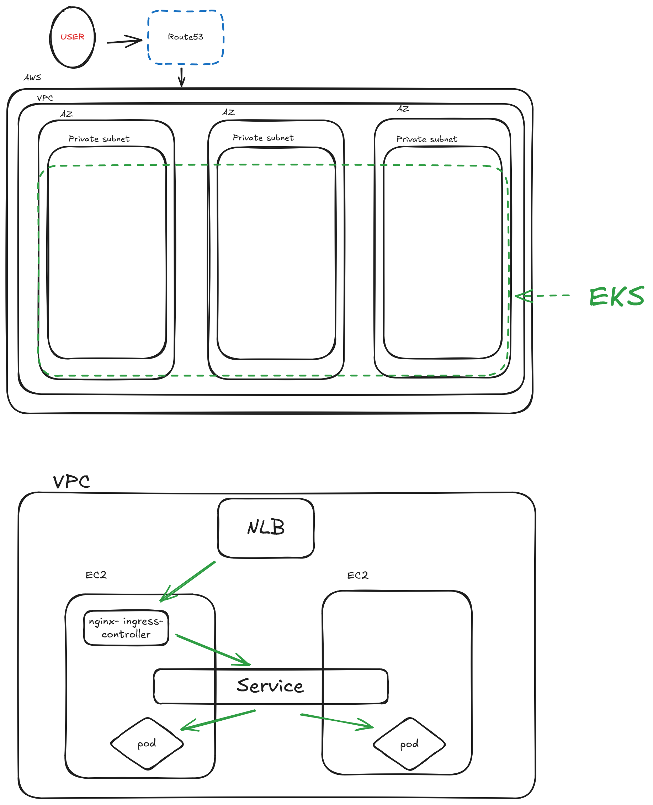

# Assumptions made

## Cloud Provider

AWS

## Publically Accessible

The app needs to be accessible over the internet via HTTPS

## Container registry

I'll use ECR to store the images

## Stateless application

The app doesn't require persistent storage

## Expertise

The team is familiar with AWS services and basic K8s operations

## Region deployment

The cluster will be deployed in multiple AZs within a single region for high availability

# Architecture diagram

